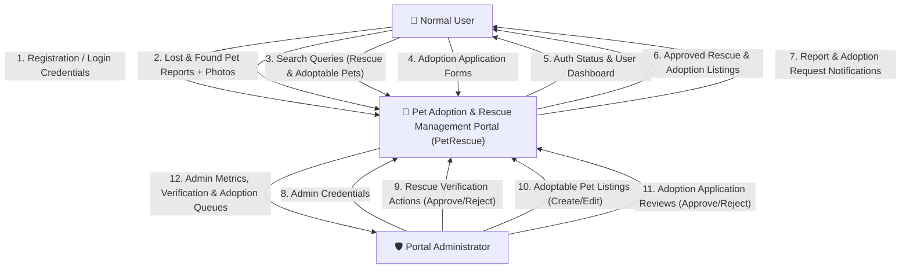

# Data Flow Diagrams (DFD) - Pet Adoption & Rescue Management Portal (PetRescue)

This document details the **Data Flow Diagrams (DFD Level 0 and Level 1)** for the **Infosys Internship Project: PetRescue Portal**, covering both **Pet Rescue** and **Pet Adoption** modules.

---

## 1. DFD Level 0 (Context Diagram)

The Level 0 Context Diagram represents the high-level boundary of the PetRescue system, depicting external entities (Normal User and Administrator) and their primary data flows for rescue and adoption activities.

### DFD Level 0 Mermaid Diagram



---

## 2. DFD Level 1 (Detailed Process Breakdown)

The Level 1 DFD decomposes the system into core operational sub-processes for rescue, adoption, search, and notification processing.

### Core Processes

1. **Process 1.0: User Registration & Authentication**
   - Validates user input, hashes passwords, manages user sessions.
2. **Process 2.0: Pet Report Submission (Rescue)**
   - Collects lost/found pet details and marks status as `PENDING`.
3. **Process 3.0: Admin Rescue Verification Workflow**
   - Admin reviews pending rescue reports, approves or rejects listings, and logs reviewer notes.
4. **Process 4.0: Adoptable Pet Listing Management (Adoption)**
   - Staff lists pets available for adoption with health status, age, location, and photos.
5. **Process 5.0: Adoption Application Processing (Adoption)**
   - Logged-in users submit adoption applications (`PENDING`). Staff reviews applications and marks them `APPROVED` or `REJECTED`.
6. **Process 6.0: Search & Retrieval Engine**
   - Filters database queries to retrieve **`APPROVED` rescue reports** and **`AVAILABLE` adoptable pets**.
7. **Process 7.0: Notification Generator & Signal Handler**
   - Triggers automated notifications on report status updates, adoption application decisions, and potential match alerts.

---

### DFD Level 1 Mermaid Diagram

```mermaid
graph TB
    subgraph External Entities
        U["👤 Normal User"]
        A["🛡️ Administrator"]
    end

    subgraph Processes
        P1["1.0<br>User Auth & Registration"]
        P2["2.0<br>Rescue Report Submission"]
        P3["3.0<br>Rescue Admin Verification"]
        P4["4.0<br>Adoptable Pet Management"]
        P5["5.0<br>Adoption Application Review"]
        P6["6.0<br>Search & Filter Engine"]
        P7["7.0<br>Notification Signal Handler"]
    end

    subgraph Data Stores (MySQL)
        DS1[("D1: User Account Store<br>(auth_user)")]
        DS2[("D2: Pet Report Store<br>(petrescue_app_petreport)")]
        DS3[("D3: Adoptable Pet Store<br>(petrescue_app_adoptablepet)")]
        DS4[("D4: Adoption Request Store<br>(petrescue_app_adoptionrequest)")]
        DS5[("D5: Notification Store<br>(petrescue_app_notification)")]
    end

    %% Process 1 Flows
    U -->|"Registration / Login"| P1
    P1 -->|"Save / Authenticate"| DS1
    P1 -->|"Session Token"| U

    %% Process 2 & 3 (Rescue)
    U -->|"Submit Lost/Found Report"| P2
    P2 -->|"Save PENDING Report"| DS2
    A -->|"Review Pending Rescue Queue"| P3
    P3 -->|"Update Status (APPROVE/REJECT)"| DS2
    P3 -->|"Rescue Status Event"| P7

    %% Process 4 & 5 (Adoption)
    A -->|"Add Adoptable Pet"| P4
    P4 -->|"Save Adoptable Pet"| DS3
    U -->|"Submit Adoption Application"| P5
    P5 -->|"Save PENDING Request"| DS4
    A -->|"Review Application (APPROVE/REJECT)"| P5
    P5 -->|"Update Request Status & Pet Status"| DS4
    P5 -->|"Adoption Status Event"| P7

    %% Process 7 (Notifications)
    P7 -->|"Create Notification"| DS5
    DS5 -->|"Display User Notifications"| U

    %% Process 6 (Search Engine)
    U -->|"Search Criteria (Rescue & Adoption)"| P6
    DS2 -->|"Query APPROVED Rescue Reports"| P6
    DS3 -->|"Query AVAILABLE Adoptable Pets"| P6
    P6 -->|"Filtered Listings"| U
```

---

## 3. Data Store Descriptions

| Store ID | Data Store Name | Description | Key Attributes |
| :--- | :--- | :--- | :--- |
| **D1** | `auth_user` | User authentication table | `id`, `username`, `email`, `password`, `is_staff` |
| **D2** | `petrescue_app_petreport` | Lost & Found pet reports table | `id`, `user_id`, `report_type`, `pet_type`, `breed`, `location`, `status` |
| **D3** | `petrescue_app_adoptablepet` | Pets available for adoption table | `id`, `added_by_id`, `name`, `species`, `breed`, `age`, `gender`, `health_status`, `status` |
| **D4** | `petrescue_app_adoptionrequest` | User adoption applications table | `id`, `user_id`, `adoptable_pet_id`, `housing_type`, `experience`, `reason`, `contact`, `status` |
| **D5** | `petrescue_app_notification` | User notifications table | `id`, `user_id`, `title`, `message`, `is_read`, `created_at` |
